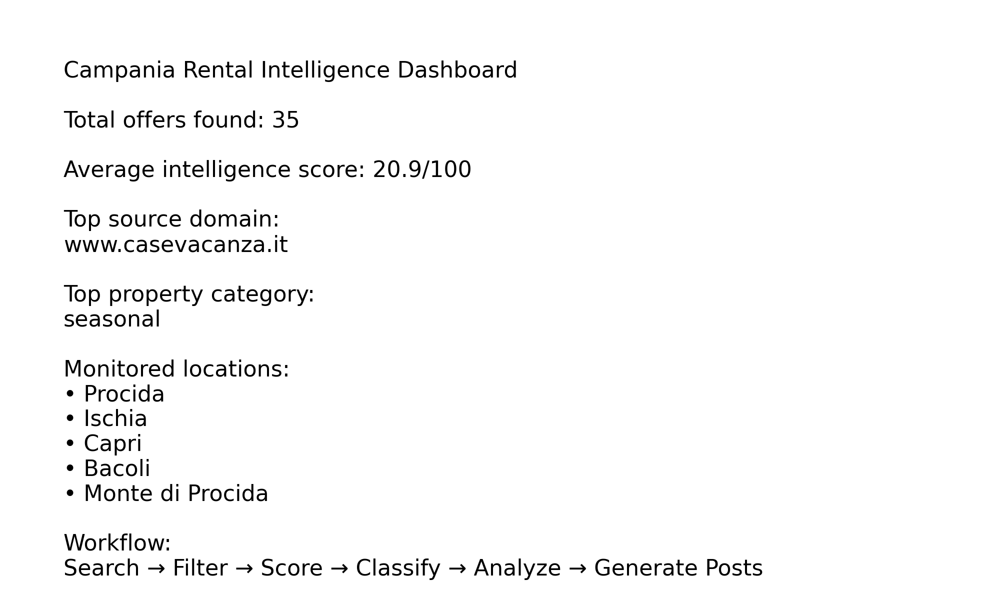
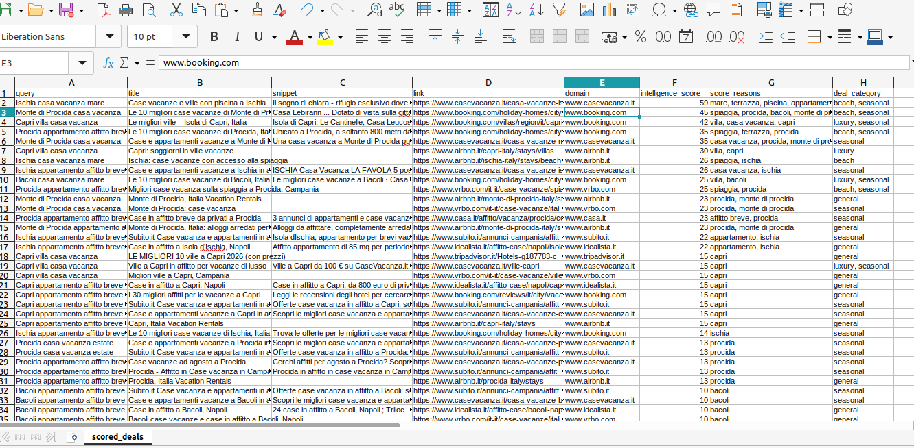
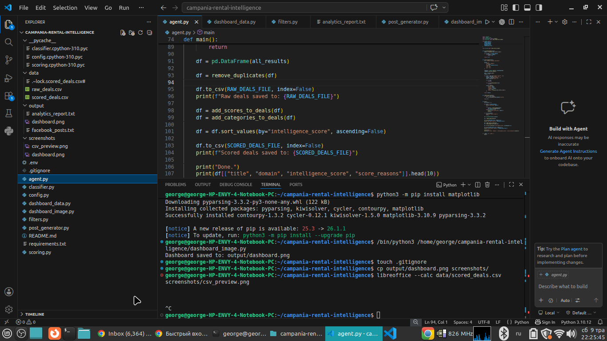
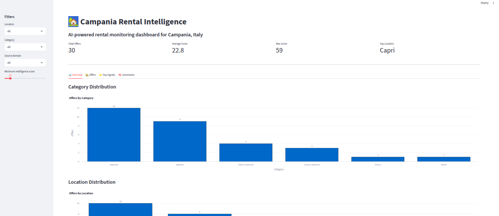

# Campania Rental Intelligence Platform

AI-powered real estate monitoring and rental intelligence system for the Campania region in Italy.

Focused areas:
- Procida
- Ischia
- Capri
- Bacoli
- Monte di Procida

---

## Project Overview

This project automatically searches and analyzes rental opportunities from multiple online sources using:

- Google Search
- SerpAPI
- Python automation
- pandas data processing
- scoring algorithms
- classification logic
- automated content generation

The platform is designed as a lightweight real estate intelligence pipeline for short-term rental monitoring and property research.

---

## Main Features

### Automated Search Monitoring
The system collects rental offers using Google Search queries related to:
- vacation rentals
- short-term apartments
- seasonal properties
- villas and beach houses

---

### Data Filtering
The agent:
- removes duplicate links
- filters domains
- structures search results
- stores clean datasets

---

### Intelligence Scoring
Each property receives an AI-style intelligence score based on:
- sea proximity keywords
- luxury signals
- tourism relevance
- seasonal indicators
- location relevance

Example:
- Capri properties receive additional score weight
- beach-related listings increase priority
- vacation rental keywords improve ranking

---

### Property Classification
Listings are automatically categorized into:
- luxury
- beach
- seasonal
- family
- budget
- investment

---

### Analytics Reporting
The platform generates:
- market overview reports
- top categories
- source domain statistics
- top-scored properties

---

### Automated Social Media Content
The system creates Facebook-ready posts for real estate pages and rental monitoring feeds.

---

## Tech Stack

- Python
- pandas
- requests
- SerpAPI
- CSV pipelines
- Google Search automation

---

## Project Structure

```text
campania-rental-intelligence/
│
├── agent.py
├── config.py
├── filters.py
├── scoring.py
├── classifier.py
├── post_generator.py
├── dashboard_data.py
│
├── data/
│   ├── raw_deals.csv
│   ├── scored_deals.csv
│   └── published_posts.csv
│
├── output/
│   ├── facebook_posts.txt
│   └── analytics_report.txt
│
├── screenshots/
│
├── README.md
├── requirements.txt
└── .env
```

---

## Workflow

```text
Search →
Filter →
Score →
Classify →
Analyze →
Generate Posts
```

---

## Example Output

The system generates:
- structured CSV datasets
- analytics reports
- categorized rental offers
- AI-style ranking scores
- ready-to-publish Facebook content

---

## Future Improvements

Planned features:
- Telegram alerts
- Google Sheets integration
- automatic Facebook publishing
- dashboard visualization
- trend monitoring
- price tracking
- duplicate detection improvements

---

## Use Cases

- real estate monitoring
- rental intelligence
- property research
- short-term rental analysis
- tourism market tracking
- lead generation
- OSINT-style web research

---

## Author

Yurii Vasylenko

Python Automation | Rental Intelligence | Data Processing

---

## Dashboard Preview



---

## Dataset Example



---

## Terminal Workflow



---

## Streamlit Dashboard

